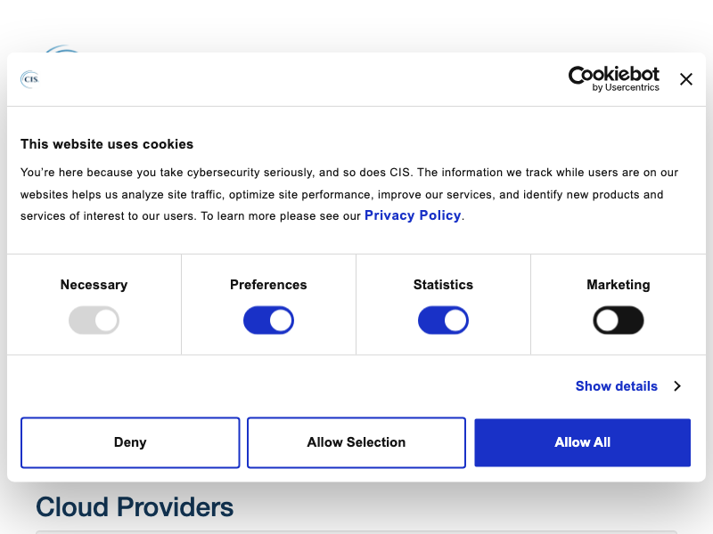

# CIS Benchmarks

这个 Python 脚本自动从官方 CIS (Center for Internet Security) 网站下载 CIS Benchmarks PDF 文件。它将下载的文件按各自的技术类别进行组织，并自动处理认证过程。

## 功能特点

- 自动获取所有可用的 CIS 技术类别
- 根据技术类型创建有组织的文件夹结构
- 为每种技术下载最新的 benchmark PDF
- 通过进度条显示下载进度
- 自动处理认证和 cookies
- 支持跨平台操作 (Windows/Linux/macOS)

## 系统要求

- Python 3.7 或更高版本
- pip (Python 包安装器)

## 安装

1. 克隆此仓库：

```bash
git clone <repository-url>
cd <repository-directory>
```

2. 安装所需依赖：

```bash
python3 -m venv .venv & source .venv/bin/active
pip install -r requirements.txt
```

## 所需依赖

```bash
requests
pyppeteer
rich
urllib3
```

## 使用方法

只需运行脚本：

```bash
python3 cis_benchmarks.py
```

该脚本将：

1. 从 CIS 获取所有可用的技术类别
2. 为每种技术创建必要的文件夹
3. 下载最新的基准测试 PDF
4. 显示每个下载的进度

## 文件结构

下载的基准测试将按以下结构组织：

```bash
.
├── Technology Category 1/
│   ├── Benchmark1.pdf
│   └── Benchmark2.pdf
├── Technology Category 2/
│   └── Benchmark3.pdf
└── ...
```

## 注意事项

- 脚本使用异步操作以提高性能
- 对于已存在的文件会跳过下载
- CIS 网站的 SSL 验证已被禁用
- 进度条显示每个文件的下载状态

## 免责声明

此工具仅供合法使用。在下载 CIS 基准测试时，请确保您拥有必要的权限并遵守 CIS 的服务条款。

## License



## Useful Infomation

```plaintext
# Technology list request url
# https://downloads.cisecurity.org/technology
# Latest pdf request url
# https://downloads.cisecurity.org/technology/7618/benchmarks/latest
```

Benchmarks response json file sample

```python
benchmarks = {
    7603:{
        "tech_path": "CIS macOS Safari Benchmark",
        "resource_list": [
                    {
                        "resource_filename": "CIS_macOS_Safari_Benchmark_v2.0.0_Archive.pdf",
                        "resource_pdf_url": "https://workbench.cisecurity.org/cis/api/v1/file/1822/download",
                    }
                ]
    }
}
```
